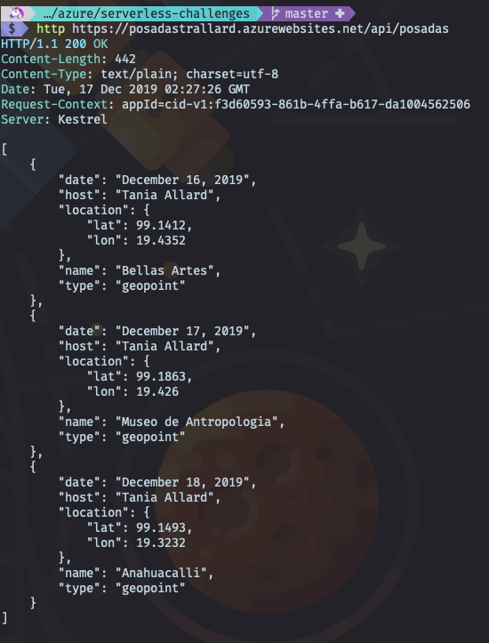
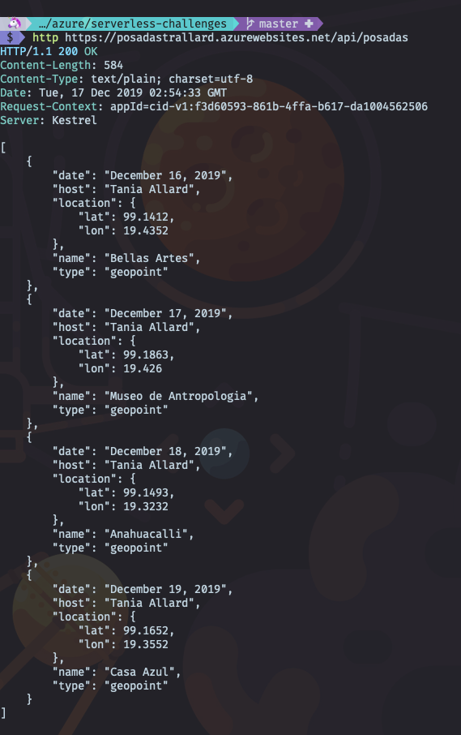

## #25DaysofServerless - Day 16th "Let the posadas begin"

- [#25DaysofServerless - Day 16th &quot;Let the posadas begin&quot;](#25daysofserverless---day-16th-quotlet-the-posadas-beginquot)
- [What is in this repo?](#what-is-in-this-repo)
- [Resources/Tools Used 🚀](#resourcestools-used-%f0%9f%9a%80)
  - [Getting started with Azure Functions for Python](#getting-started-with-azure-functions-for-python)
  - [Continuous integration and delivery](#continuous-integration-and-delivery)
  - [Developer Tools](#developer-tools)
- [Next Steps 🏃](#next-steps-%f0%9f%8f%83)
- [License 📖](#license-%f0%9f%93%96)

This challenge and the solutions are part of the [#25DaysOfServerless](https://25daysofserverless.com).

:sparkles: You can find the challenge here 👉🏼 <https://25daysofserverless.com/calendar/16>.

📝 The article with the detailed explanation of the solutions can be found at <https://dev.to/azure/let-the-posadas-begin-day-16-of-the-25daysofserverles-challenge-57hm>

## What is in this repo?

- An Http triggered Azure function written in Python. Where the user can either pass a day as a query string or submit a simple GET request to the main endpoint to see all the posadas locations.

💻 See it in [./posadas](./posadas/)

Sample outputs:

- All dates query

- Single date query

- Workflows for GitHub actions to deploy the Azure function to Azure 

💻 See it in [.github/workflows](.github/workflows)

## Resources/Tools Used 🚀

### Getting started with Azure Functions for Python
* **[Azure Functions Python](https://docs.microsoft.com/azure/azure-functions/functions-reference-python?WT.mc_id=academic-0000-taallard)**

### Continuous integration and delivery 
* **[GitHub Actions](https://help.github.com/en/actions/automating-your-workflow-with-github-actions)**
* **[Azure DevOps](https://docs.microsoft.com/azure/devops/?view=azure-devops%2F%3FWT.mc_id%3D25daysofserverless-github-cxa&WT.mc_id=academic-0000-taallard)**
* **[Getting started with Azure Pipelines](https://docs.microsoft.com/azure/devops/pipelines/ecosystems/python?view=azure-devops%3FWT.mc_id%3D25daysofserverless-github-cxa&WT.mc_id=academic-0000-taallard)**
* **[Azure Functions Continuous delivery using Azure DevOps](https://docs.microsoft.com/azure/azure-functions/functions-how-to-azure-devops/?WT.mc_id=academic-0000-taallard)**
* **[Azure FunctionsContinuous delivery using GitHub actions](https://docs.microsoft.com/azure/azure-functions/functions-how-to-github-actions/?WT.mc_id=academic-0000-taallard)**

### Developer Tools
* **[Visual Studio Code](https://code.visualstudio.com/?WT.mc_id=academic-0000-taallard)** 
* **[Visual Studio Code Azure Functions Extension](https://marketplace.visualstudio.com/items?itemName=ms-azuretools.vscode-azurefunctions&WT.mc_id=academic-0000-taallard)** 
* **[Visual Studio Code Python Extension](https://marketplace.visualstudio.com/items?itemName=ms-python.python&WT.mc_id=academic-0000-taallard)**

## Next Steps 🏃

Learn more about serverless with Free Training! 

- ✅ **[Serverless Free Courses](https://docs.microsoft.com/learn/browse/?term=azure&WT.mc_id=academic-0000-taallard functions&WT.mc_id=academic-0000-taallard)** 

## License 📖

All the code containing in this repository is licensed under the [BSD-3 clause OSI license](https://opensource.org/licenses/BSD-3-Clause).